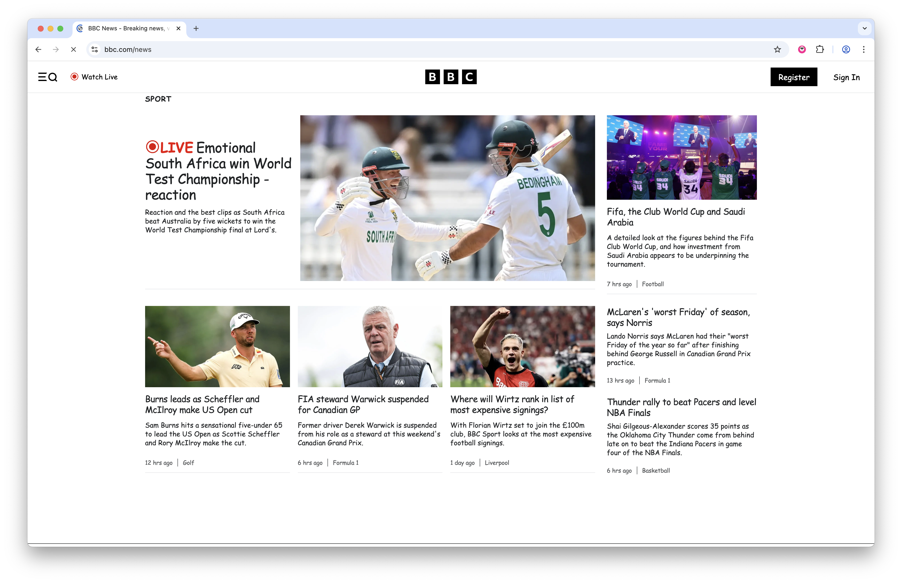

# 💀 Piss off all the designers in the world 💀

🔥💀 **OBLITERATE THE TYPOGRAPHY ESTABLISHMENT** 💀🔥 

A Chrome extension that transforms any website into a beautiful Comic Sans masterpiece and watch design purists LITERALLY WEEP.

## 🎯 What it does

This weapon of mass font destruction will make every Helvetica lover question their life choices. Simply toggle the extension on any webpage to replace ALL fonts with the glorious Comic Sans MS.



## ⚠️ Warning

May cause:
- Spontaneous designer rage
- Uncontrollable eye twitching  
- Immediate unfriending on LinkedIn
- Career changes
- Therapy sessions
- Angry tweets about 'proper typography'

**USE WITH EXTREME CAUTION** 🎨💥

## 🚀 Installation

### From Chrome Web Store
*Coming soon...*

### Manual Installation
1. Download the latest release zip
2. Go to `chrome://extensions/`
3. Enable "Developer mode" 
4. Click "Load unpacked"
5. Select the extracted folder
6. Start your reign of typographic terror! 💀

## 🎮 Usage

1. Click the skull icon in your Chrome toolbar
2. Toggle "Enable Comic Sans" 
3. Watch designers everywhere shed a single tear
4. Enjoy the beautiful Comic Sans typography
5. Toggle off to restore boring fonts

## 🛠️ Development

```bash
git clone https://github.com/ghuntley/piss-off-all-designers-in-the-world.git
cd piss-off-all-designers-in-the-world
```

Load the extension in Chrome developer mode and start terrorizing typography.

## 📦 Building

GitHub Actions automatically creates release zips. Create a new release to trigger the build.

## 🤝 Contributing

Pull requests welcome! Help us make designers cry even more efficiently.

## 📄 License

MIT License - Geoffrey Huntley 2025

---

*"Typography is the craft of endowing human language with a durable visual form."* - **NOT ANYMORE** 💀🔥
