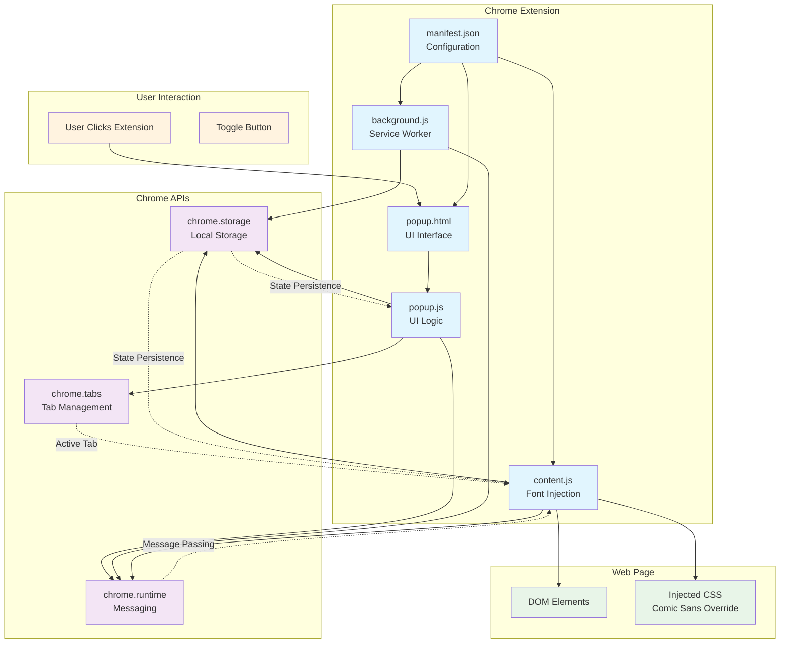
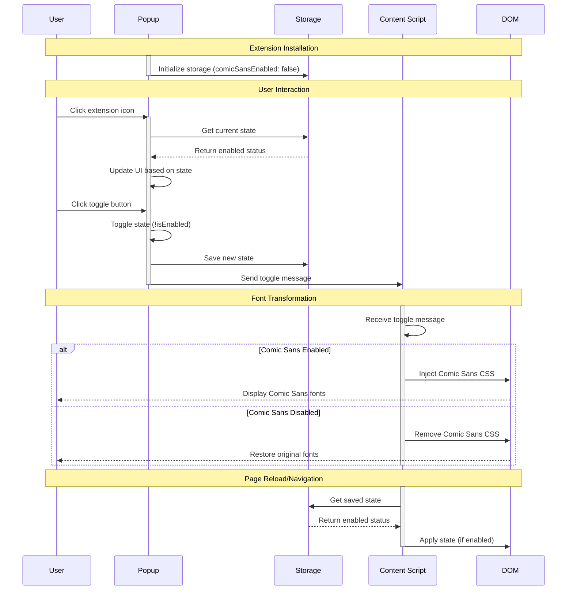
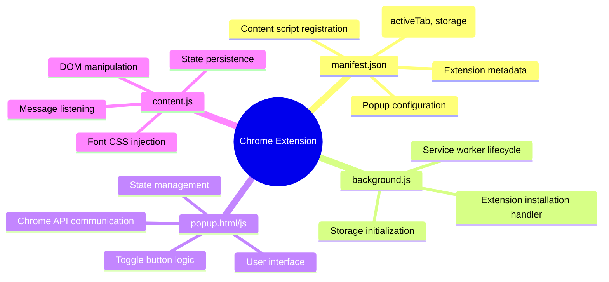

# Chrome Extension Architecture

```mermaid
graph TB
    subgraph "Chrome Extension"
        M[manifest.json<br/>Configuration]
        BG[background.js<br/>Service Worker]
        P[popup.html<br/>UI Interface]
        PJS[popup.js<br/>UI Logic]
        CS[content.js<br/>Font Injection]
    end
    
    subgraph "Chrome APIs"
        S[chrome.storage<br/>Local Storage]
        T[chrome.tabs<br/>Tab Management]
        R[chrome.runtime<br/>Messaging]
    end
    
    subgraph "Web Page"
        DOM[DOM Elements]
        CSS[Injected CSS<br/>Comic Sans Override]
    end
    
    subgraph "User Interaction"
        U[User Clicks Extension]
        TB[Toggle Button]
    end
    
    %% Connections
    U --> P
    P --> PJS
    PJS --> S
    PJS --> T
    PJS --> R
    
    BG --> S
    BG --> R
    
    CS --> DOM
    CS --> CSS
    CS --> R
    CS --> S
    
    M --> BG
    M --> CS
    M --> P
    
    R -.-> |Message Passing| CS
    T -.-> |Active Tab| CS
    S -.-> |State Persistence| PJS
    S -.-> |State Persistence| CS
    
    %% Styling
    classDef extension fill:#e1f5fe
    classDef api fill:#f3e5f5
    classDef webpage fill:#e8f5e8
    classDef user fill:#fff3e0
    
    class M,BG,P,PJS,CS extension
    class S,T,R api
    class DOM,CSS webpage
    class U,TB user
```

## Extension Flow

```mermaid
sequenceDiagram
    participant U as User
    participant P as Popup
    participant S as Storage
    participant C as Content Script
    participant D as DOM
    
    Note over U,D: Extension Installation
    activate P
    P->>S: Initialize storage (comicSansEnabled: false)
    deactivate P
    
    Note over U,D: User Interaction
    U->>P: Click extension icon
    activate P
    P->>S: Get current state
    S-->>P: Return enabled status
    P->>P: Update UI based on state
    
    U->>P: Click toggle button
    P->>P: Toggle state (!isEnabled)
    P->>S: Save new state
    P->>C: Send toggle message
    deactivate P
    
    Note over U,D: Font Transformation
    activate C
    C->>C: Receive toggle message
    alt Comic Sans Enabled
        C->>D: Inject Comic Sans CSS
        D-->>U: Display Comic Sans fonts
    else Comic Sans Disabled
        C->>D: Remove Comic Sans CSS
        D-->>U: Restore original fonts
    end
    deactivate C
    
    Note over U,D: Page Reload/Navigation
    activate C
    C->>S: Get saved state
    S-->>C: Return enabled status
    C->>D: Apply state (if enabled)
    deactivate C
```

## Component Responsibilities

```mermaid
mindmap
  root((Chrome Extension))
    manifest.json
      Extension metadata
      Permissions (activeTab, storage)
      Content script registration
      Popup configuration
    background.js
      Service worker lifecycle
      Extension installation handler
      Storage initialization
    popup.html/js
      User interface
      Toggle button logic
      State management
      Chrome API communication
    content.js
      Font CSS injection
      DOM manipulation
      Message listening
      State persistence
```